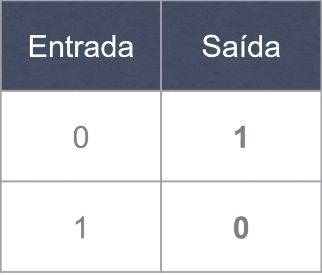
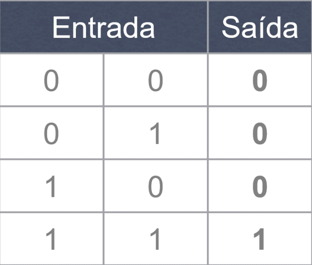
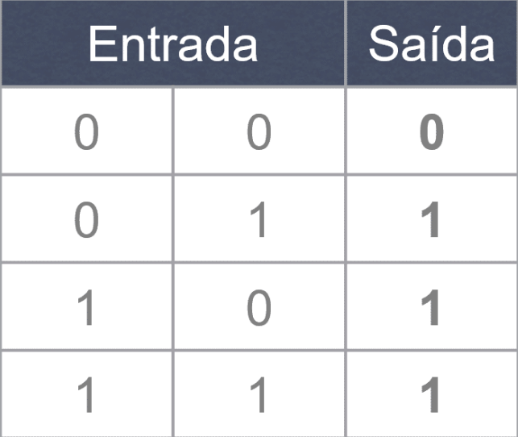
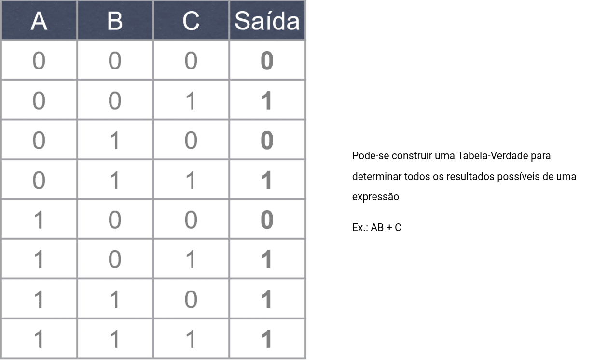
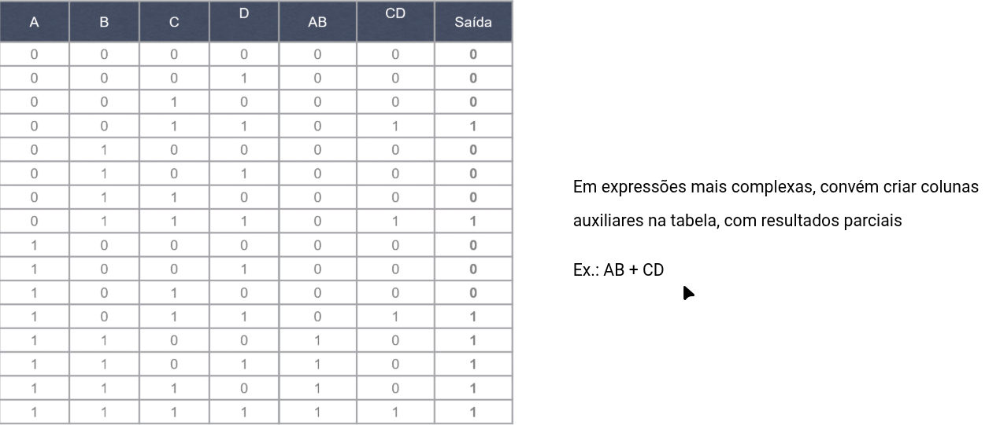

# Álgebra Booleana

## Operadores

Mecanismos que recebem um ou dois bits (valores verdadeiro/falso) de entrada e produzem um bit de resultado na saída:

- Unitários --> o operador recebe apenas 1 bit de entrada;
- Binários --> o operador recebe apenas 2 bit de entrada;

 

### NOT, AND e XOR

---

#### A) NOT

Negação - Operador unário que inverte o valor do bit de entrada

---

#### B) AND

Também chamado de “E”

Operador binário que obedece às seguintes regras:

- Se qualquer dos bits de entrada for 0, a saída será 0;
- Se ambos os bits de entrada forem 1, a saída será 1.

---

#### C) OR

Também chamado de “OU”

Operador binário que obedece às seguintes regras:

- Se ambos os bits de entrada forem 0, a saída será 0;
- Se qualquer dos bits de entrada for 1, a saída será 1.

---

#### D) XOR

Também chamado de “OU exclusivo” - eXclusive OR

Operador binário que obedece às seguintes regras:

- Se os bits de entrada forem iguais, a saída será 0;
- Se os bits de entrada forem diferentes, a saída será 1.

**Utilizado para comparação de Bits**

---

### PRECEDÊNCIA DE OPERADORES

#### Os operadores são normalmente aplicados com a seguinte ordem de precedência:

1- ( ) e [ ]

2 - NOT

3- AND

4- OR e XOR

- Entre operadores de mesmo nível, a aplicação é feita da esquerda para a direita.

## Simplificação de notação

É possível (e útil!) trabalhar expressões booleanas utilizando variáveis, ao invés de valores

Ex.: A AND B, onde A e B são variáveis que podem assumir qualquer valor lógico (0 ou 1)

Para simplificar a notação, utilizam-se símbolos para representar os operadores:

- NOT A = A|(pipe em cima)
- A AND B = A.B = AB
- A OR B = A + B
- A XOR B = A⊕B

Ex. A AND B OR C AND NOT D = AB + CD|(pipe em cima)

## TABELA-VERDADE com Expressões

