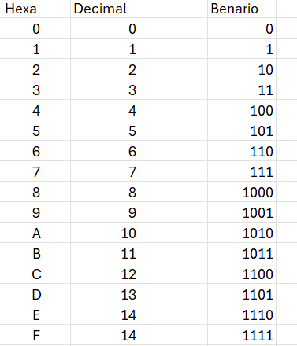

## Sistemas de Numeração

## Natural - decimal ou base10
Elementos: 0, 1, 2, 3, 4, 5, 6, 7, 8, 9

---

## Binário --> base 2   
Elementos: 0, 1

### Conversão de Binario --> decimal
---
1100 --> 
0 x 2zero = 0
0 x 2um = 0
1 x 2dois = 4
1x 2tres = 8
8 + 4 = 12

101011 -->
1 x 2zero = 1
1 x 2um = 2
0 x 2dois = 0
1 x 2tres = 8
0 x 2quatro = 0
1 x 2cinco = 32
32+8+2+1 = 11 + 32 = 43 

1100110 -->
0 x 2zero = 0
1 x 2um = 2
1 x 2dois = 4
0 x 2tres = 0
0 x 2quatro = 0
1 x 2cinco = 32
1 x 2seis = 64
64 + 32 + 4 + 2 = 102

01100110 -->
0 x = 0
1 x 2um = 2
1 x 2dois = 4
0 x = 0
0 x = 0
1 x 2cinco = 32
1 x 2seis = 64
0 x = 0
64 + 32 + 4 + 2 = 102

001100110 -->
 = 102

--- 
### Conversão de Decimal para Binario
---

- 1) Fazer a divisão inteira do número por 2, anotando o resto da divisão;

- 2) Dividir o quociente da divisão anterior novamente por 2, também anotando o resto;

- 3) Repetir o processo até que o quociente dê zero.

1 dividido por 2  === zero --> leva o 1 !!

---
 

## Hexadecimal --> base 16

Elementos: 0, 1, 2, 3, 4, 5, 6, 7, 8, 9, A, B, C, D, E, F

#### Esse sistema é conveniente porque a base é múltipla da base binária:
- Cada dígito hexadecimal corresponde a um número inteiro de bits
- De certa forma, é uma representação “compacta” da notação binária

#### No sistema hexadecimal, as posições dos dígitos representam potências em base 16
1, 16, 256, 4096, 65536, ...

---

### Conversão de Hexadecimal para Decimal
---

Ex.: 1F49

16zero -- 9 x 1= 9  
16um -- 4 x 16 = 64  
16dois --15 x 256 = 3840  
16tres --1 x 4096 = 4096

Soma = 9 + 64 + 3840 + 4096 = 8009 

--- 
### Conversão de Decimal para Hexadecimal
---

- Mesma regra da conversão de Deciaml para binário, porém divide-se por 16 e aceitam-se restos até 15, sendo 10 = A ... 15 = F
