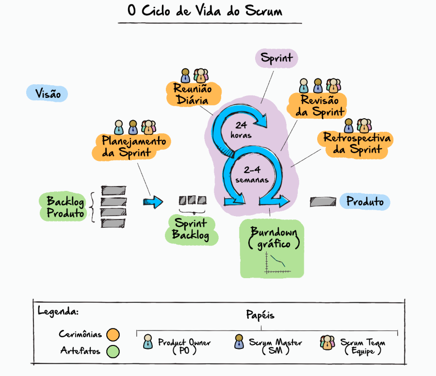
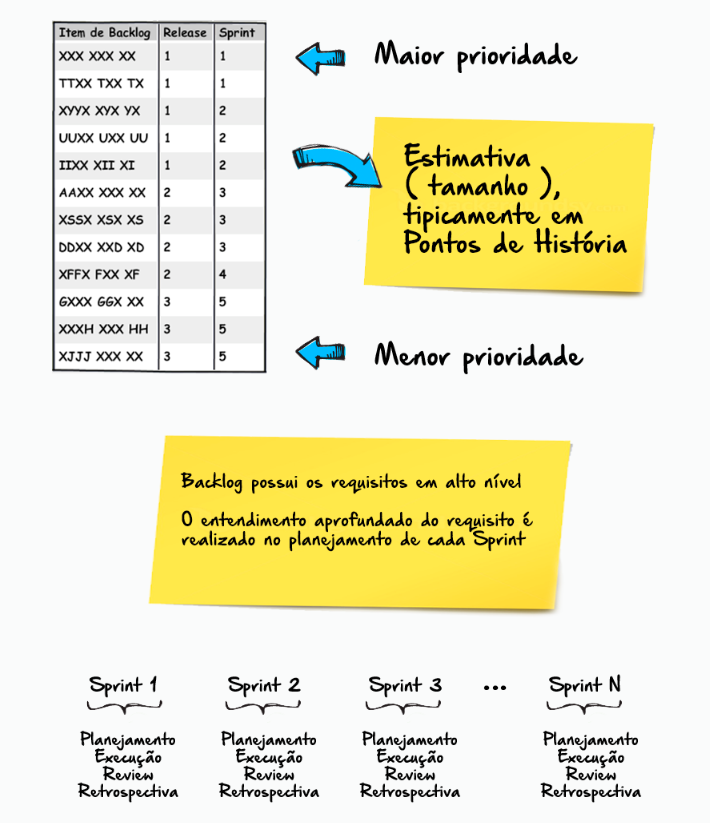
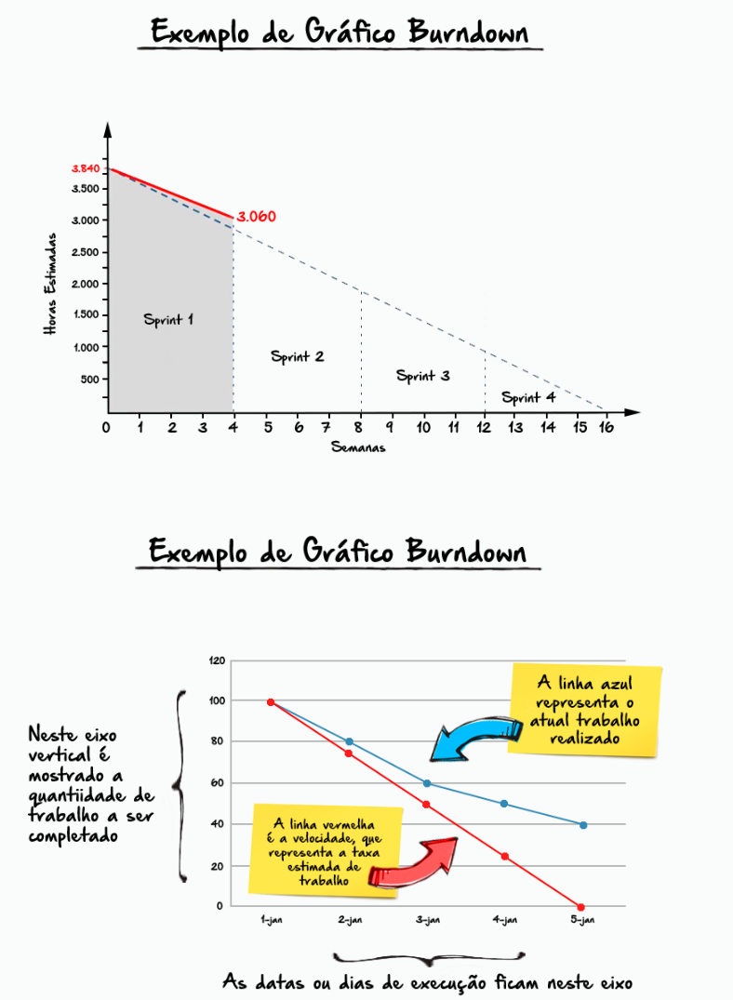

# SCRUM

Scrum é um tipo de abordagem ágil;

Scrum é um framework dentro do qual as pessoas podem resolver problemas adaptativos complexos, enquanto, produtivamente e criativamente, entregam produtos com o mais alto valor possível.

O ciclo de vida do Scrum é composto das cerimônias.

A partir de uma determinada visão de produto é gerado um artefato chamado: Product Backlog, que pode ser interpretado como uma lista de requisitos ou lista de User Stories - estórias de usuário;

Após a definição do Product Backlog tem início o ciclo do Scrum e a realização de suas cerimônias.

## Sprint

O coração do Scrum é a Sprint, um time-box, geralmente de 2-4 semanas, no qual uma versão potencialmente utilizável de um incremento do produto é criada;

- Sprints tem durações consistentes ao longo do esforço de desenvolvimento. Um novo Sprint começa imediatamente depois da conclusão da Sprint anterior.

Sprints consistem em:

- Uma reunião de planejamento do Sprint;

- Reunião Diária;

- O trabalho de desenvolvimento;

- A reunião de revisão do Sprint;

- A Retrospectiva do Sprint.

### Cerimônias do Scrum

---

• Planejamento da Sprint (Cerimônia 1)

O trabalho a ser executado na Sprint é planejado na Reunião de Planejamento da Sprint;

Este plano é criado pelo trabalho colaborativo de toda a equipe do Scrum.

• Reunião Diária (Cerimônia 2)

A Reunião Diária é um evento com 15 minutos fixos para a Equipe de Desenvolvimento sincronizar as atividades e criar um plano para as próximas 24 horas;

Isso se faz inspecionando o trabalho até a última Reunião Diária e prevendo o trabalho que pode ser Pronto antes da próxima.

• Revisão da Sprint (Cerimônia 3)

A Reunião de Revisão da Sprint é executada no final do Sprint para inspecionar o Incremento e adaptar ao Backlog do Produto se necessário;

Durante a Revisão da Sprint, a Equipe de Scrum e stakeholders colaboram sobre o que foi Pronto na Sprint.

• Retrospectiva da Sprint (Cerimônia 4)

A retrospectiva da Sprint é uma oportunidade para a Equipe do Scrum inspecionar-se a si mesma e criar um plano de melhorias que deve ser valer durante a próxima Sprint.

## Papeis do Scrum

Times Scrum's são projetados para otimizar flexibilidade e produtividade. Para esse fim eles são auto-organizados de forma interdicliplinar e trabalham em iterações:

- Product Owner:

    Maximiza o valor do trabalho que o Scrum Team faz;

- Scrum Master:

    Resposável por garantir que o processo seja compreebdido e seguido;

- Scrum Team
  Executa o trabalho propriamente dito.

O time scrum consiste em uma equipe de desenvolvimento com todas as habilidades necessárias para transformar os requisitos do Product Backlog em um protótipo do produto até o final da sprint

## Artefatos do Scrum

- Product Backlog = que pode ser interpretado como uma lista de requisitos ou lista de User Stories - estórias de usuário;

- Sprint Backlog = que pode ser interpretado como a lista de requisitos detalhada tecnicamente;

- Gráfico de Burndown = que permite o acompanhamento visual do projeto.

## Fontes para pesquisa:

- COHN, Mike. Desenvolvimento de software com Scrum. Porto Alegre:
  Bookman, 2011.
- POPPENDIECK, Mary. Implementando o desenvolvimento Lean de software
  do conceito ao dinheiro. Porto Alegre: Bookman, 2011.
- Prikladnicki, Rafael; Willi, Renato; Milani, Fabiano. Métodos ágeis para
  desenvolvimento de software. Porto Alegre: Bookman, 2014.
