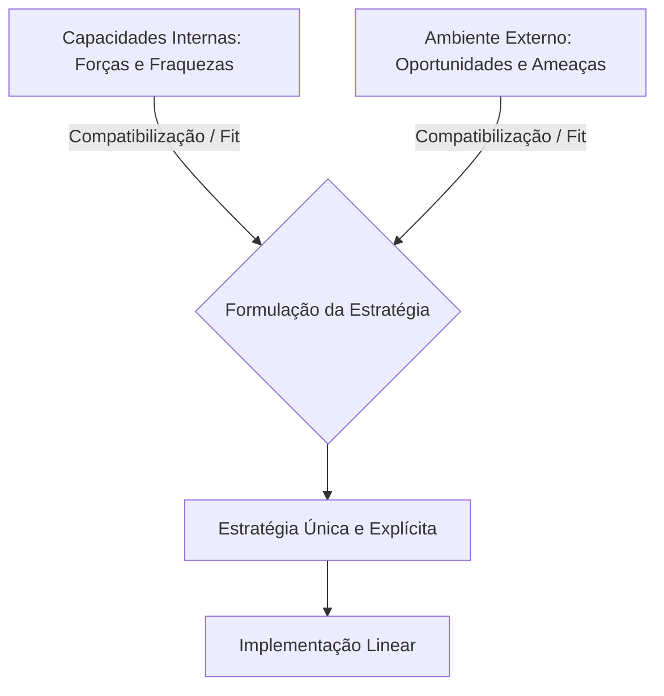

# A Escola de Design: A Formulação de Estratégia como um Processo de Concepção
## 1. Gênese e Fundamentos Epistemológicos
A Escola de Design representa a abordagem mais influente no processo de formulação estratégica, estabelecendo a base sobre a qual as escolas de *Planejamento* e *Posicionamento* construíram suas estruturas. Sua origem remonta aos trabalhos pioneiros do grupo de Política de Negócios da *Harvard Business School*, consolidando-se definitivamente com a publicação do livro-texto clássico de Kenneth Andrews (dentro do trio Christensen, Andrews e Guth).
Em termos epistemológicos, esta escola propõe um modelo de correspondência (*fit*) essencial entre as capacidades internas da organização e as possibilidades externas do ambiente circundante.

## 2. O Modelo Cânone: A Análise SWOT
O arcabouço central da Escola de Design reside no desmembramento do diagnóstico organizacional em duas dimensões analíticas independentes que se cruzam na formulação:
### Avaliação Externa
 * **Variáveis:** Oportunidades e Ameaças presentes no macroambiente e no ecossistema setorial.
 * **Resultante:** Identificação dos *Fatores Chave de Sucesso* (FCS) exigidos pelo mercado.
### Avaliação Interna
 * **Variáveis:** Forças (*Strengths*) e Fraquezas (*Weaknesses*) inerentes à estrutura e aos processos da firma.
 * **Resultante:** Mapeamento das *Competências Essenciais* (*Distinctive Competences*) que conferem vantagem competitiva.
> [!important] **Fatores Intervenientes Não Econômicos**
> O modelo de Andrews introduz duas variáveis subjetivas adjacentes à matriz técnica:
>  1. **Valores Gerenciais:** As preferências éticas, crenças e inclinações pessoais dos executivos que comandam a organização.
>  2. **Responsabilidade Social:** As expectativas da sociedade e o contexto ético externo no qual a empresa está inserida.
> 
## 3. As Sete Premissas Axiomáticas da Escola de Design
Para que o modelo funcione conforme o projetado por seus idealizadores, assume-se dogmaticamente um conjunto de premissas estritas:
 1. **Processo Consciente e Controlado:** A estratégia não surge espontaneamente; ela deve ser o produto de um pensamento humano deliberado, racional e altamente reflexivo.
 2. **O Executivo Principal como Arquiteto:** O CEO é o estrategista supremo. Ele não apenas gerencia processos, mas concebe a arquitetura estratégica da organização de forma centralizada.
 3. **Simplicidade e Informalidade do Modelo:** O design metodológico deve ser mantido simples para evitar o engessamento cognitivo e a dependência de sistemas formais complexos.
 4. **Estratégias Únicas e Customizadas:** O resultado do processo de concepção deve ser um design individualizado, perfeitamente adaptado à situação singular da empresa, rejeitando fórmulas genéricas.
 5. **Formulação como Epifania (Conclusão Holística):** A estratégia emerge do processo de design totalmente formada. Ela é uma imagem completa que precisa ser vislumbrada antes da sua execução.
 6. **Articulação e Explicitação:** As estratégias devem ser claras, explícitas e fáceis de comunicar, permitindo que toda a organização compreenda a direção pretendida.
 7. **Separação Estrita entre Formulação e Implementação:** O pensamento precede a ação. A estrutura organizacional deve se adaptar passivamente à estratégia previamente concebida (*structure follows strategy*).
## 4. Críticas Metodológicas e o Abismo Teórico
Embora atraente pelo seu ordenamento lógico, Mintzberg e seus coautores desferem duras críticas à Escola de Design, evidenciando as falhas de sua aplicação prática no ambiente corporativo contemporâneo.
> [!danger] **A Falácia da Separação entre Pensar e Agir**
> A dissociação rígida entre a formulação (concepção) e a implementação (execução) assume que o topo da pirâmide organizacional detém a onisciência sobre a realidade da base. Na prática, este isolamento impede o aprendizado estratégico incremental.

 * **Negação do Aprendizado Emergente:** Ao exigir que a estratégia esteja totalmente pronta antes da ação, a escola ignora que muitas estratégias eficazes surgem do tateamento operacional e de padrões de comportamento que dão certo no dia a dia (*estratégias emergentes*).
 * **Rigidez Cognitiva perante a Volatilidade:** A exigência de estratégias explícitas e imutáveis pode cegar a organização face a mudanças abruptas no ambiente. O apego ao "design original" frequentemente resulta em cegueira estratégica.
 * **Superficialidade no Diagnóstico Interno:** A análise de forças e fraquezas baseia-se puramente em percepções e julgamentos da gerência executiva, carecendo, muitas vezes, de testes empíricos ou de uma avaliação profunda dos recursos reais da firma (infraestrutura, rotinas e cultura).
