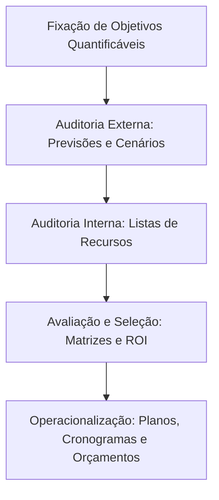

# A Escola de Planejamento: A Formulação de Estratégia como um Processo Formal
## 1. Gênese e o Império dos Planejadores Profissionais
Se a Escola de Design (Capítulo 2) colocou o peso do mundo nas costas do CEO-arquiteto, a **Escola de Planejamento** decidiu que confiar na intuição humana era um risco inadmissível. Emergindo em paralelo nos anos 1960 e atingindo seu ápice histérico na década de 1970, esta abordagem reflete uma tentativa obsessivo-compulsiva de transformar a estratégia em um algoritmo previsível e altamente documentado.
O texto seminal que inaugura essa era é *Corporate Strategy* (1965), de **Igor Ansoff**. A partir dele, o processo deixa de ser uma concepção informal e passa a ser dominado por uma nova casta corporativa: os **planejadores profissionais** (o *staff* especializado), armados com planilhas, cronogramas e uma fé inabalável na formalização.
## 2. O Modelo Básico: A Decomposição Mecânica da Estratégia
Enquanto a Escola de Design operava com um modelo SWOT enxuto, a Escola de Planejamento pegou o mesmo conceito e o fragmentou em centenas de etapas burocráticas interligadas. O princípio aqui é a **decomposição analítica**: se um problema é grande demais, desmonte-o até que ele vire uma lista de tarefas para burocratas executarem.

### Macroetapas do Processo Cânone:
 * **Fixação de Objetivos:** Ao contrário da fixação de valores da escola anterior, aqui exige-se a **quantificação estrita**. Metas não quantificadas são tratadas como inexistentes.
 * **Auditoria Externa:** Desenvolvimento de técnicas sofisticadas de previsão do futuro (projeções macroeconômicas, análise de cenários, etc.) para tentar neutralizar a incerteza do ambiente.
 * **Auditoria Interna:** Listagens exaustivas de recursos e competências, frequentemente engessadas em checklists departamentais.
 * **Avaliação e Seleção:** Utilização de critérios puramente financeiros e quantitativos (retorno sobre o investimento - ROI, análise de fluxo de caixa descontado, matrizes de portfólio) para escolher a estratégia "ótima".
 * **Operacionalização (A Hierarquia de Planos):** A estratégia escolhida é desdobrada em planos de curto, médio e longo prazo, subestratégias corporativas, planos de contingência e, finalmente, no Santo Graal da burocracia: o **orçamento (*budget*)**.
## 3. As Premissas Dogmáticas da Escola de Planejamento
Para que essa engrenagem pesada faça algum sentido, os teóricos da escola assumem como verdade absoluta que:
 1. **A Estratégia é Fruto da Formalização:** O processo é controlado, consciente e dividido em etapas claras, apoiadas por técnicas analíticas e checklists.
 2. **O Poder Desloca-se para os Planejadores:** Na teoria, o CEO é o tomador de decisão; na prática, quem controla o fluxo de dados, as premissas e a formatação dos relatórios são os planejadores de *staff*. O executivo vira um homologador de planos.
 3. **Estratégias Prontas e Explicitadas:** O output do processo é um calhamaço de planos detalhados, prontos para serem comunicados e implementados de forma linear.
> [!important] **O "Plano para Planejar" (George Steiner)**
> A obsessão com o controle técnico chegou ao ponto de exigir a criação de um plano que regulasse o próprio ato de planejar, definindo cronogramas, quem participa de cada comitê e quais formulários devem ser preenchidos antes mesmo de se discutir o negócio.
> 
## 4. O Contra-Ataque de Mintzberg: As Três Grandes Falácias
O núcleo duro do Capítulo 3 é a autópsia que Mintzberg faz do colapso do planejamento estratégico tradicional na década de 1980. Ele demonstra que o modelo ruiu porque se sustentava sobre três falácias lógicas destrutivas:
### A. A Falácia da Predeterminação
O planejamento assume que o ambiente pode ser previsto com precisão ou, no mínimo, estabilizado por decretos corporativos. Em mercados voláteis, tentar prever o cenário econômico ou a reação dos concorrentes em um plano rígido de 5 anos é um exercício de adivinhação fantasiado de ciência.
### B. A Falácia do Descolamento (*Detachment*)
Os planejadores operam isolados em suas torres de marfim, alimentando-se exclusivamente de **dados frios** (*hard data*: relatórios financeiros, estatísticas agregadas).
> [!danger] **O Perigo dos Dados Frios**
> Dados quantitativos são ótimos para avaliar o passado, mas são historicamente incapazes de capturar as nuances sutis, os sussurros do mercado e as impressões qualitativas (*soft data*) que o gestor obtém diretamente no campo de batalha. O descolamento da realidade operacional cega o estrategista.
> 
### C. A Falácia da Formalização
A escola acredita que o processo de criação de estratégia pode ser institucionalizado e automatizado por meio de um sistema formal. No entanto, os sistemas formais servem apenas para ordenar, processar e consolidar conceitos que *já existem*. A criação, a inovação e o insight estratégico são processos essencialmente não lineares e intuitivos, impossíveis de serem reproduzidos por um fluxograma.
## 5. O Grande Paradoxo: Contribuição Real vs. Limitação
A conclusão acadêmica e inevitável de Mintzberg é brutal, Rodrigo: **o planejamento estratégico não é um processo de formulação estratégica.** As organizações que tentaram usar essa escola para criar novas direções falharam miseravelmente. O real papel do planejamento não é criar o novo, mas sim **programar** as estratégias que já foram concebidas por outros meios (geralmente de forma intuitiva ou emergente).
Portanto, o nome correto para essa prática deveria ser **Programação Estratégica**: a atividade legítima de operacionalizar, quantificar e dar ordem ao caos de uma estratégia já existente, garantindo o controle operacional da firma.
