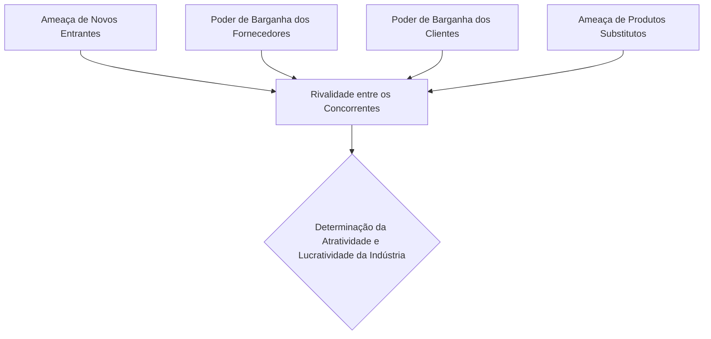
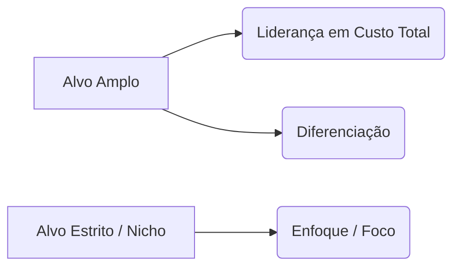

# A Escola de Posicionamento: A Formulação de Estratégia como um Processo Analítico
## 1. Gênese e a Virada Analítica dos Anos 1980
A **Escola de Posicionamento** dominou o pensamento estratégico na década de 1980, promovendo uma verdadeira revolução copernicana na administração. Se a escola de Design focava em um artesanato customizado (SWOT) e a de Planejamento se afogava em manuais de procedimentos internos, a Escola de Posicionamento determinou que a estratégia se resume a uma coisa: **encontrar uma posição defensável no mercado econômico**.
O grande divisor de águas aqui é **Michael Porter**, com o lançamento de *Competitive Strategy* (1980). A partir desse marco, a estratégia deixa de ser uma arte intangível ou um exercício de preenchimento de cronogramas e passa a ser tratada como uma ciência econômica dura, baseada em cálculos matemáticos, dados estatísticos estruturados e análise rigorosa da estrutura da indústria.
## 2. A Evolução Histórica em Três Ondas
Ao contrário do que os porterianos mais fanáticos defendem, a ideia de posicionamento não nasceu em Harvard. Mintzberg reconstrói essa trajetória identificando três grandes momentos históricos:
### A. A Primeira Onda: As Máximas Militares Antigas
As raízes mais remotas estão nos tratados de estratégia militar, como os de **Sun Tzu** (*A Arte da Guerra*) e **Von Clausewitz**. O foco era identificar posições geográficas e táticas genéricas ideais para derrotar o inimigo. Havia uma crença platônica de que existiam "leis universais" da guerra que garantiriam a vitória se aplicadas analiticamente no campo de batalha.
### B. A Segunda Onda: Os Imperativos de Consultoria dos Anos 1970
Esta onda foi impulsionada por firmas de consultoria — destacando-se o *Boston Consulting Group* (BCG) — que comercializavam matrizes prontas para corporações.
 * **A Curva de Experiência:** A premissa mecânica de que o custo unitário de produção cai proporcionalmente ao aumento da produção acumulada.
 * **A Matriz BCG:** O infame quadrante que reduzia divisões inteiras de empresas multibilionárias a categorias biológicas ou astronômicas ("vacas leiteiras", "estrelas", "pontos de interrogação" e "vira-latas/abacaxis"), transformando a gestão de portfólio em um jogo de tabuleiro financeiro.
### C. A Terceira Onda: O Trabalho Empírico de Michael Porter (Anos 1980)
Porter eleva o nível do debate ao importar conceitos da Economia de Organização Industrial. A premissa central é que a lucratividade de uma empresa não depende da sua "boa vontade" ou da sua "cultura", mas sim da **estrutura da indústria** em que ela opera.

## 3. O Core Analítico Porteriano: Forças e Estratégias Genéricas
### A. O Modelo das Cinco Forças Competitivas
O nível de concorrência e a atratividade de uma indústria são determinados por cinco forças macroeconômicas. O estrategista deve mapear matematicamente cada uma delas para entender onde o valor está sendo retido ou destruído:
 1. **Rivalidade entre Concorrentes:** A intensidade da disputa interna por *market share*.
 2. **Ameaça de Novos Entrantes:** Barreiras à entrada existentes (economias de escala, capital necessário, patentes).
 3. **Poder de Barganha dos Fornecedores:** Capacidade de impor preços e reduzir a margem da firma.
 4. **Poder de Barganha dos Clientes:** Capacidade dos compradores de pressionar por menores preços e maior qualidade.
 5. **Ameaça de Produtos Substitutos:** Tetos de preço impostos por tecnologias ou soluções alternativas fora do setor tradicional.
### B. As Estratégias Genéricas
Porter defende agressivamente que existem apenas **três posições fundamentais** que uma organização pode assumir para obter vantagem competitiva sustentável. Tentar ficar no meio do caminho é o passaporte para o limbo corporativo (*stuck in the middle*).

 * **Liderança em Custo Total:** Foco obsessivo na eficiência operacional, economias de escala e minimização de despesas para oferecer o menor preço do mercado.
 * **Diferenciação:** Criação de um produto ou serviço percebido pela indústria como único, permitindo a cobrança de um *premium price* (preço de exclusividade).
 * **Enfoque (Foco):** Concentração em um nicho de mercado estrito (um grupo de compradores, segmento de linha de produtos ou mercado geográfico), aplicando Liderança em Custo ou Diferenciação exclusivamente dentro desse microuniverso.
## 4. As Premissas Dogmáticas da Escola de Posicionamento
Para aceitar o modelo analítico como a verdade definitiva da estratégia, é necessário subscrever o seguinte credo econômico:
 1. **Estratégias são Posições Genéricas:** As estratégias são posições específicas, genéricas e identificáveis no mercado. Não há espaço para soluções estritamente "artísticas" ou únicas; você escolhe um figurino pronto no armário de Porter.
 2. **O Contexto é Puramente Econômico:** O mercado é estruturado por forças econômicas competitivas brutas. Aspectos culturais, políticos e sociais são secundários ou meros ruídos na matriz.
 3. **O Processo é Puramente Analítico:** A formulação estratégica é um processo de cálculo analítico e seleção de opções. O pensamento criativo é substituído pelo processamento rigoroso de matrizes de dados.
 4. **Os Analistas Controlam a Prancheta:** Os analistas de mercado (os *staffs* analíticos com MBAs caros) fazem as contas, geram os gráficos e entregam o cardápio de opções para os gerentes, que atuam apenas como tomadores de decisão formais.
> [!important] **A Cadeia de Valor como Bisturi**
> Para apoiar esse processo de posicionamento, Porter introduz a *Cadeia de Valor*, dividindo a firma em Atividades Primárias (logística, operações, marketing) e de Apoio (RH, infraestrutura, tecnologia). O objetivo é estritamente analítico: isolar cada custo e cada fonte de valor para otimizar a margem em relação à concorrência.
> 
## 5. Críticas Epistemológicas e Limitações Teóricas
Mintzberg e os críticos da vertente analítica apontam que a Escola de Posicionamento reduziu a estratégia a um exercício frio de contabilidade de mercado, gerando graves patologias corporativas:
 * **Parálise por Análise e o Abismo Quantitativo:** A dependência excessiva de dados frios e relatórios de analistas criou uma gerência desconectada da realidade operacional. Estuda-se a indústria exaustivamente enquanto a empresa definha por incapacidade de execução.
 * **Foco no Grande e no Estático:** O modelo de Porter funciona perfeitamente para indústrias maduras, oligopólios consolidados e mercados estáveis (como montadoras de carros ou siderúrgicas). Ele falha de forma catastrófica em ambientes de alta volatilidade, startups digitais e setores movidos por disrupção tecnológica contínua, onde as barreiras de entrada evaporam da noite para o dia.
 * **A Falácia das Estratégias Genéricas:** Se todas as empresas de um mesmo setor utilizam os mesmos analistas, os mesmos dados de mercado e as mesmas estratégias genéricas de Porter, o resultado inevitável é a **convergência competitiva**. As empresas tornam-se idênticas, destruindo a verdadeira diferenciação e transformando o mercado em uma guerra sangrenta de preços.
 * **Negligência do Aprendizado e das Competências Internas:** Ao focar excessivamente no posicionamento *externo* (o mercado), a escola ignora que a verdadeira vantagem competitiva muitas vezes vem de dentro — da capacidade da firma de aprender, de sua cultura organizacional e do desenvolvimento de competências difíceis de copiar, elementos que nenhuma planilha do Excel consegue mensurar de forma satisfatória.