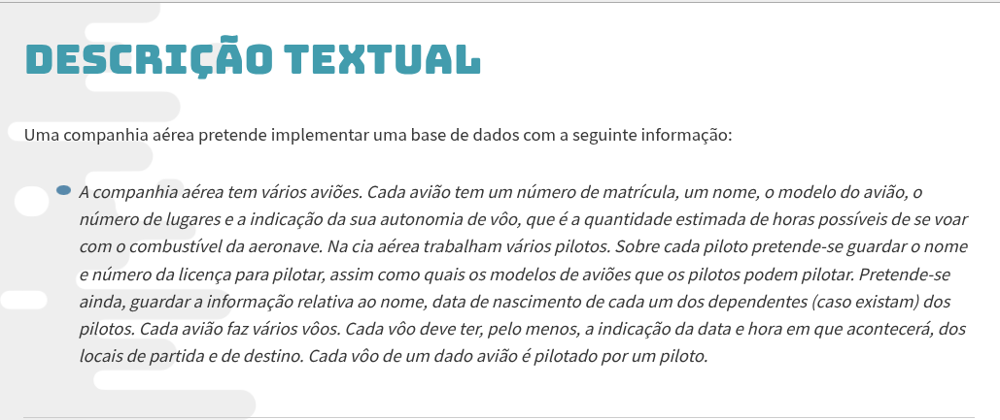
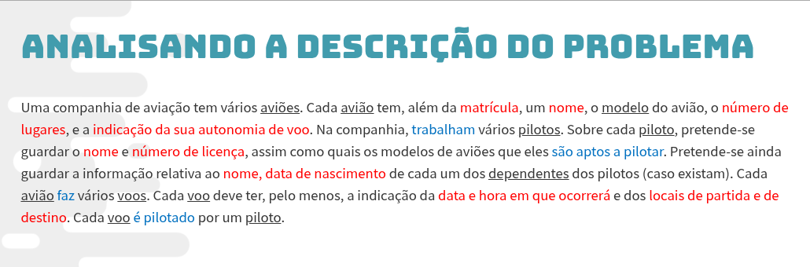
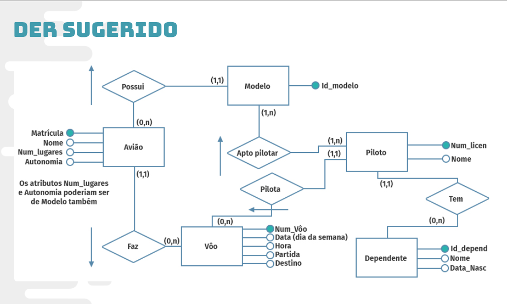

## Levantamento de requisitos e Modelagem

A partir da descriçao/ entrevista com cliente:

- Substantivos --> Possiveis Entidades --> Sublinhar

- Caracteristicas dos substantivos--> Possiveis Atributos --> Destaquar em Vermelho

- Verbos --> Possiveis Relacionamentos -->  Destaquar em Azul:
Existe alguma relaçao com o substantivo(entidade)?

  

 

 
