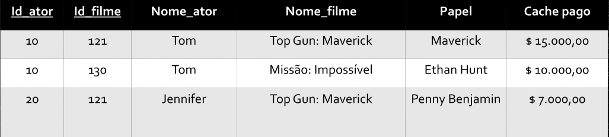
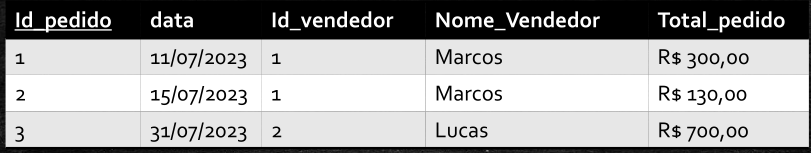

# Dependência Funcional
DF A --> B, sendo:  
A == a chave primária

- Atributo - "Nome_ator":  
Tem uma dependência funcional parcial --> depende apenas do "id_ator"

- Atributo - "Nome_filme":  
Tem uma dependência funcional parcial --> depende apenas do "id_filme"

- Atributo - "Papel":  
Tem uma dependência funcional total --> depende do "id_ator" e do "id_filme", pois ele é interpretado somente por aquele ator, somente naquele filme.

- O mesmo acima para o "Cache pago"

 

## Dependência Funcional Transitiva

Quado temos uma dependência de 1 atributo em relação a outro atributo, mas não a uma pk!

ver acima a DF Transitiva entre Nome_vendedor e seu id_vendedor, que NÃO depende da pk

**OBS.:**  
**Para resolver esse tipo de dependência --> criar uma outra entidade com "id_vendedor (pk)" x "Nome_vendedor" e trazer para a entidade principal apenas o "id_vendedor"**