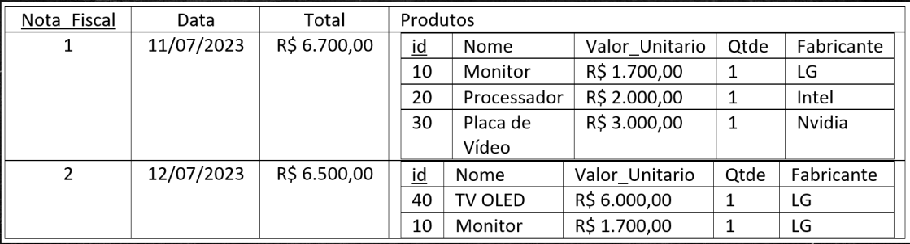
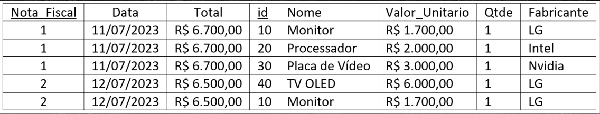
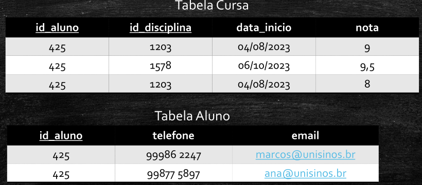
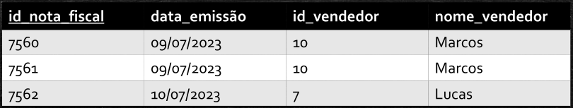
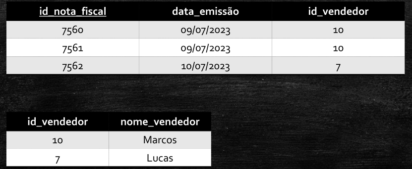

# Primeira Forma Normal (1FN): 

Uma tabela está na 1FN quando ela garantir que cada tabela tenha:  
- **A)** 1 **chave primária única**;  
- **B)** Os valores em cada coluna devem ser **atômicos** -->   
    - b.1) Não possuam **atributos múltivalorados agrupados** do **mesmo domínio**(o dado que se relaciona a mesma informação)  
    - b.2) Quando tiver um mesmo domínio, **evitar de mantê-lo** em **atributos diferentes** (atributos multivalorados disfarçados de colunas)   
    *ver desvantagem abaixo*  
    - b.3) A informação **não seja composta**.

Exemplo 1
---

  

### Normalização para a 1FN:
---
Preferência em criar nova tabela com pk composto para manter **chave primária única**

Se a regra de negócio ditar que um cliente pode ter múltiplos telefones **sem um teto fixo** (1-N), a criação da entidade Telefone é a abordagem correta e recomendada pela teoria relacional.   
Use **colunas fixa**s apenas se a regra de negócio for estrita e imutável (por exemplo, exigir **obrigatoriamente** e **exclusivamente** um telefone fixo e um celular).

 

Exemplo 2
---

### Normalização para a 1FN:
---

### Tabela dentro de tabela:   
Desmembrar a "2º tabela" e manter apenas 1 com pk composto (pk tabela 1 + pk "2º tabela")

### Desvantagens para item b.2):
---

- Falta de escalabilidade/flexibilidade: Se um cliente tiver 3 ou mais telefones, o esquema precisará de uma alteração de DDL (ALTER TABLE) para adicionar telefone_3.

- Presença excessiva de valores nulos (NULL): Clientes com apenas um telefone deixarão colunas vazias, gerando inconsistência e desperdício de metadados.

- Dificuldade em consultas: Para verificar se um telefone existe, a query precisa checar múltiplos campos

---

 

---

### OBS.:

Dependência Funcional transitiva - como resolver?
---
Temos uma DF-Transitiva quando um valor de uma coluna depende de outra coluna que não a chave-primária(pk)

Construir uma outra tabela com os elementos inter-dependentes

 

 

---

# Segunda Forma Normal (2FN):

Uma tabela está na 2FN se e somente se:   
**a)** estiver na 1FN;  
**b)** quando todo atributo (não pk) tem uma DF Total com a sua pk (e não com apenas parte dela).
> #### Obs.: o atributo pk deve ser composto para se aplicar a 2FN

- **"data_inicio":**   

    "data_inicio" depende apenas de "id_aluno", apenas de "id_disciplina" ou do pk composto como um todo??  
    Pq "data_inicio" tem DF Total com o pk composto?  

    Vários alunos cursam várias disciplinas (N,N)--> terei varias datas de início, a depender qd cada aluno iniciou a disciplina e qd cada disciplina foi iniciada também(a cada semestre e a cada ano)...

    *Agora, 1 aluno iniciou determinada disciplina apenas 1 vez em 1 data específica --> o atributo aqui se refere a **pk composta**  

    **Está na 2FN**

 

- **"nota"**:  
Segue a 2FN também;  
**Está na 2FN**

 

- **"telefone" e "email"**:   
Depende apenas do "id_aluno";  
**Não está** na 2FN

 

Normalização para a 2FN:
---
Não deixar na mesma tabela **atributos** que **não dependam completamente da pk**

---

 

 

# Terceira Forma Normal (3FN):
Uma tabela está na 3FN se e somente se:  
Elimina dependências transitivas, garantindo
que **não haja colunas não chave que dependam de outras colunas não chave**.

Normalização para a 3FN:
---

 

---

### OBS.:

Ver que a dependencia funcional entre id_vendedor e nome_vendedor se repentem em conjunto pelo menos 1x nas colunas --> repetição de informação --> para melhor desempenho do BD aplicar a 3FN

